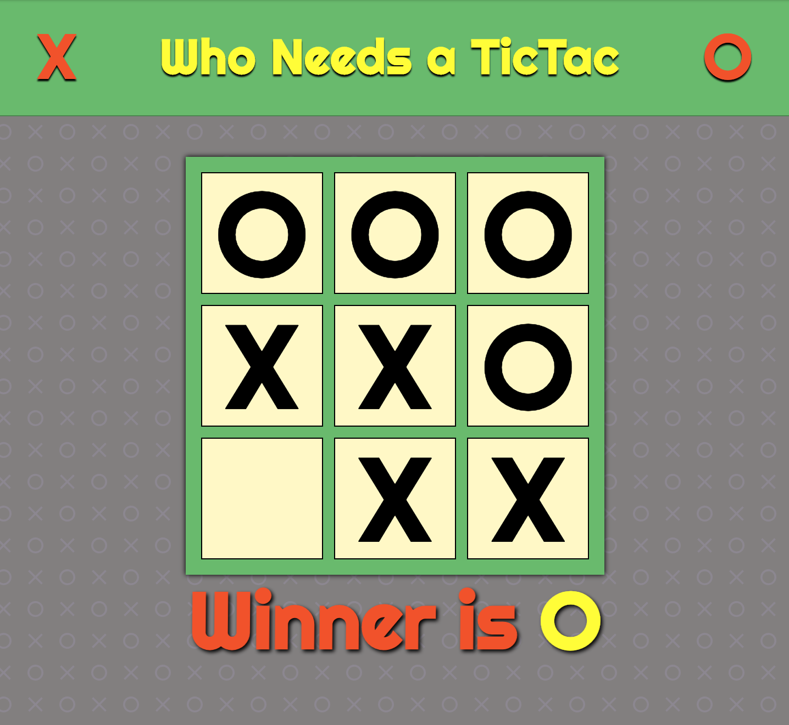
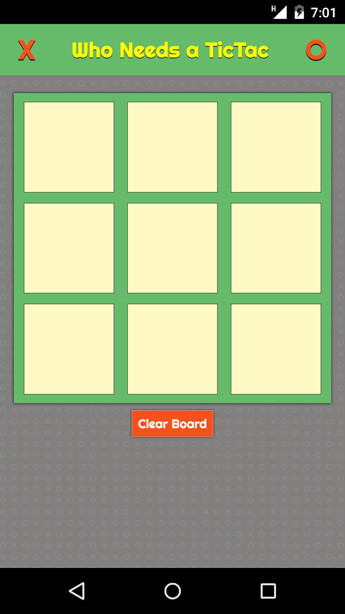
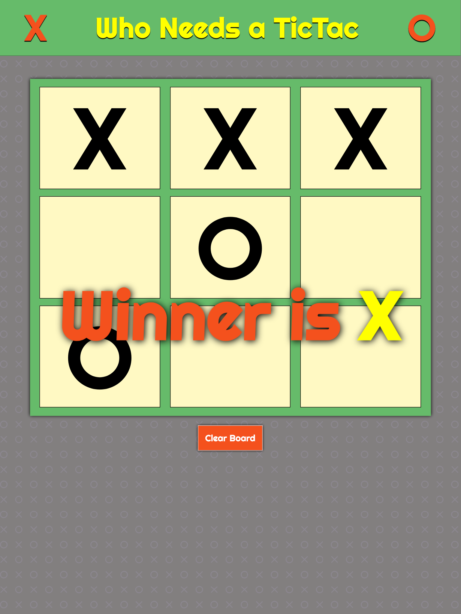

Project: *Who Needs a TicTac*

#### Intro
Goal: This is web version of Tic-Tac-Toe.

CodePen: [Code sample here.](https://codepen.io/SixStringsCoder/pen/ZwqKpJ?editors=1010)

##### Technical Components
- CSS FlexBox
- JavaScript (ECMASript 6)
- React 16.8.3

#### Pictures of Responsive Design
###### Phone

###### Tablet

###### Desktop

#### Future Features / To-do list
- Add 'Tie' message
- Connect to trivia question where correct answer gets to make a move or correct answer gets to move opponent to different space
- Add option to select other symbols other than 'X' and 'O'
